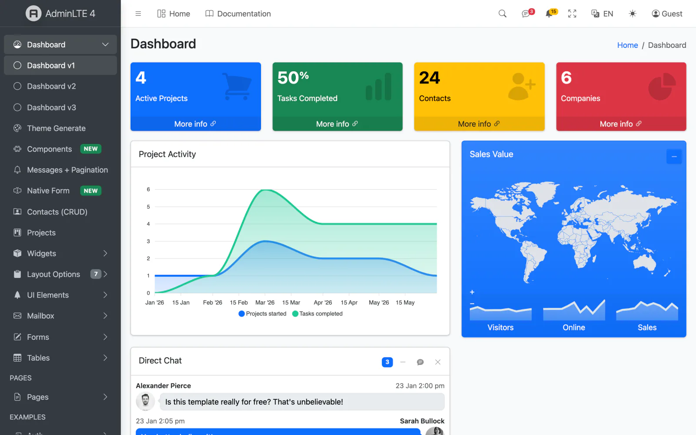

# Django AdminLTE 4

[](#license)
[](https://www.djangoproject.com/)
[](https://www.python.org/)
[](https://getbootstrap.com/docs/5.3/)
[](https://django.adminlte.io/docs/)

Official **AdminLTE 4** integration for **Django** — Bootstrap 5.3, vanilla JS,
Vite-ready. A config-driven sidebar menu with a per-request filter pipeline, an
AdminLTE 4 base layout, a library of [django-components](https://github.com/django-components/django-components),
a themed `django.contrib.admin`, and first-class hooks into Django's own forms,
tables, auth, messages, pagination and i18n. By [Colorlib](https://colorlib.com).

**Live demo:** [django.adminlte.io](https://django.adminlte.io/) · **Docs:** [django.adminlte.io/docs](https://django.adminlte.io/docs/)

<p align="center">
  <a href="https://django.adminlte.io/">
    
  </a>
  <a href="https://django.adminlte.io/">
    
  </a>
</p>

**Available for your stack** — the same AdminLTE 4 dashboard, in the framework you know best:

<!-- ADMINLTE-ECOSYSTEM:START -->
<div align="center">
  <a href="https://github.com/ColorlibHQ/AdminLTE"></a>
  <a href="https://github.com/ColorlibHQ/adminlte-react"></a>
  <a href="https://github.com/ColorlibHQ/adminlte-react"></a>
  <a href="https://github.com/ColorlibHQ/adminlte-vue"></a>
  <a href="https://github.com/ColorlibHQ/adminlte-vue"></a>
  <a href="https://github.com/ColorlibHQ/adminlte-angular"></a>
  <a href="https://github.com/ColorlibHQ/adminlte-laravel"></a>
  <a href="https://github.com/ColorlibHQ/adminlte-symfony"></a>
  <a href="https://github.com/ColorlibHQ/adminlte-django"></a>
  <a href="https://github.com/ColorlibHQ/adminlte-aspnet"></a>
  <a href="https://github.com/ColorlibHQ/adminlte-drupal"></a>
  <a href="https://docs.adminlte.io"></a>
</div>
<!-- ADMINLTE-ECOSYSTEM:END -->

<p align="center">
  <a href="https://django.adminlte.io"></a>
</p>


> **v1 scope:** layout, menu + filter pipeline, auth pages, and the Form +
> Widget component families. Tool/plugin components (datatable, charts,
> calendar, editor, kanban, vector-map) land in v2.

## Documentation

Full documentation is published at [django.adminlte.io/docs](https://django.adminlte.io/docs/) —
Getting started, a complete [configuration reference](https://django.adminlte.io/docs/configuration/),
[components](https://django.adminlte.io/docs/components/), [admin](https://django.adminlte.io/docs/admin/),
[forms](https://django.adminlte.io/docs/forms/), [tables](https://django.adminlte.io/docs/tables/),
[auth](https://django.adminlte.io/docs/auth/), [i18n](https://django.adminlte.io/docs/i18n/),
[assets](https://django.adminlte.io/docs/assets/), [deployment](https://django.adminlte.io/docs/deployment/)
and more. The source lives in `docs/` as a **MkDocs Material** site — build/serve
it locally:

```bash
pip install -e .[docs]
mkdocs serve        # http://127.0.0.1:8000  (or: mkdocs build)
```

## Requirements

- Python 3.12+
- Django 6.0+
- `django-components` 0.150, `django-vite` 3.1+
- Node 18+ (Vite build for the front-end assets)

## Installation

```bash
pip install adminlte-django
```

### 1. Settings

```python
INSTALLED_APPS = [
    "django_components",
    # ... django.contrib.* ...
    "django_vite",
    "django_adminlte4",
]

MIDDLEWARE = [
    # ...
    "django_components.middleware.ComponentDependencyMiddleware",
]

COMPONENTS = {"dirs": [], "app_dirs": ["components"], "autodiscover": True}

TEMPLATES = [{
    "BACKEND": "django.template.backends.django.DjangoTemplates",
    "DIRS": [],
    # IMPORTANT: APP_DIRS must be False because we provide an explicit `loaders`
    # list (required by django-components).
    "APP_DIRS": False,
    "OPTIONS": {
        "context_processors": [
            "django.template.context_processors.request",
            "django.contrib.auth.context_processors.auth",
            "django_adminlte4.context_processors.adminlte",
        ],
        "loaders": [(
            "django.template.loaders.cached.Loader",
            [
                "django.template.loaders.filesystem.Loader",
                "django.template.loaders.app_directories.Loader",
                "django_components.template_loader.Loader",
            ],
        )],
        "builtins": ["django_components.templatetags.component_tags"],
    },
}]

STATICFILES_FINDERS = [
    "django.contrib.staticfiles.finders.FileSystemFinder",
    "django.contrib.staticfiles.finders.AppDirectoriesFinder",
    "django_components.finders.ComponentsFileSystemFinder",
]

DJANGO_VITE = {"default": {"dev_mode": DEBUG, "manifest_path": BASE_DIR / "assets" / "dist" / "manifest.json"}}
```

### 2. Front-end assets

```bash
python manage.py adminlte_install   # copies assets/app.js, assets/app.scss, vite.config.js stubs
npm install                          # installs admin-lte, bootstrap, overlayscrollbars, ...
npm run dev                          # dev server with HMR (DEBUG=True)
# production: npm run build && python manage.py collectstatic
```

### 3. Configure (`settings.ADMINLTE`)

```python
ADMINLTE = {
    "title": "My Dashboard",
    "logo": "<b>My</b>App",
    "sidebar_theme": "dark",          # dark | light
    "menu": [
        {"text": "Dashboard", "url": "/", "icon": "bi bi-speedometer"},
        {"header": "CONTENT"},
        {"text": "Posts", "icon": "bi bi-file-post", "submenu": [
            {"text": "All posts", "route": "posts:index", "icon": "bi bi-circle"},
            {"text": "New post", "route": "posts:create", "icon": "bi bi-circle", "can": "blog.add_post"},
        ]},
    ],
}
```

Menu item keys: `header`, `text`, `route` (named route), `url` (raw), `icon`,
`icon_color`, `label` + `label_color` (badge), `active` (URL patterns),
`target`, `can` (permission/callable — item hidden if denied), `submenu`,
`topnav`/`topnav_right`.

### Topbar dropdowns

The navbar renders Messages/Notifications dropdowns and a rich user card when
you provide their data (all optional — omit a key to hide that dropdown):

```python
ADMINLTE = {
    "logo": "<b>My</b>App",          # auth-page lockup (HTML allowed)
    "logo_alt_text": "My App",       # sidebar brand text next to the logo
    "navbar_search": True,           # search trigger icon
    "navbar_messages": {
        "count": 3,
        "items": [
            {"image": "adminlte/img/user1-128x128.jpg", "name": "Brad Diesel",
             "text": "Call me whenever you can...", "time": "4 Hours Ago",
             "star": "danger", "url": "#"},
        ],
    },
    "navbar_notifications": {
        "count": 15,
        "items": [
            {"icon": "bi bi-envelope", "text": "4 new messages", "time": "3 mins", "url": "#"},
        ],
    },
    "usermenu": {                    # rich user card; omit to fall back to the
        "image": "adminlte/img/user2-160x160.jpg",   # Django-user simple menu
        "name": "Alexander Pierce", "description": "Web Developer",
        "since": "Member since Nov. 2023",
        "stats": [{"label": "Followers", "url": "#"}, {"label": "Sales", "url": "#"}],
    },
}
```

When `usermenu` is omitted, the topbar shows a minimal menu driven by the
authenticated Django user (with a CSRF-protected POST sign-out to your `logout`
route). `color_mode_toggle` and a fullscreen toggle are always shown.

## Pages

```django

Dashboard

    <li class="breadcrumb-item active">Dashboard</li>


    
        Card body…
        Updated 5 min ago
    

```

## Components (v1)

**Widget:** `adminlte_card`, `adminlte_small_box`, `adminlte_info_box`,
`adminlte_alert`, `adminlte_callout`, `adminlte_progress`,
`adminlte_progress_group`, `adminlte_timeline`, `adminlte_description_block`,
`adminlte_profile_card`, `adminlte_ratings`, `adminlte_breadcrumb`.

**Form:** `adminlte_input`, `adminlte_textarea`, `adminlte_select`,
`adminlte_input_switch`, `adminlte_input_color`, `adminlte_input_file`,
`adminlte_button`. Bind a Django form field for automatic validation feedback:

```django

```

## Components (v2 — interactive + plugin-backed)

**Bootstrap (no extra libs):** `adminlte_modal`, `adminlte_toast`,
`adminlte_tabs`, `adminlte_accordion`, `adminlte_direct_chat`,
`adminlte_nav_messages`, `adminlte_nav_notifications`.

**Plugin-backed Tool components:** `adminlte_chart` (ApexCharts),
`adminlte_vector_map` (jsVectorMap), `adminlte_datatable` (Tabulator),
`adminlte_editor` (Quill), `adminlte_sortable` (SortableJS). Each renders a
`data-*` container with a JSON config; the shipped initializer
(`assets/adminlte-plugins.js`, installed by `adminlte_install`) lazily imports
each library only when a matching element is on the page — so you install just
the plugins you use:

```bash
npm i apexcharts jsvectormap tabulator-tables quill sortablejs   # pick what you need
```

```django



```

## Django admin theme

`django.contrib.admin` is themed with the AdminLTE 4 shell out of the box — the
topbar, and a sidebar **auto-generated from your registered apps/models** (it
reuses the same menu builder + filter pipeline as the app sidebar, so it honours
per-user view permissions and active-state). The native admin change-list /
change-form content renders inside the shell.

Enable it by putting `django_adminlte4` **before** `django.contrib.admin` in
`INSTALLED_APPS` (so its `admin/*` template overrides win):

```python
INSTALLED_APPS = [
    "django_components",
    "django_adminlte4",          # must precede django.contrib.admin
    "django.contrib.admin",
    # ...
]
```

Customise via the `ADMINLTE` dict: `admin_brand` (sidebar brand text) and
`admin_menu` (a list of menu-item dicts to replace the auto app/model menu).

## Pre-built assets (no Node required)

The package ships a compiled asset bundle (`static/adminlte/dist/`), so you can
run with **zero Node/npm** — just `collectstatic`. The themed admin always uses
it; switch the front-end layout to it with:

```python
ADMINLTE = {"assets_mode": "static"}   # default "vite"
```

`"vite"` keeps the HMR/dev pipeline (and the optional plugin set) via
`django-vite`; `"static"` serves the shipped bundle (Bootstrap + AdminLTE +
Bootstrap Icons + OverlayScrollbars + color-mode/init). With `"static"`,
`django-vite` is not imported at all.

## Messages, pagination & auth

**Messages** — Django's messages framework is rendered as dismissible AdminLTE
alerts automatically (included in the base layout). Levels map to Bootstrap
classes with an icon, and `error` → `danger`, so no `MESSAGE_TAGS` config is
required. Override the `` to customise.

**Pagination** — a reusable partial for any Django `Paginator` page that
preserves the current query string (filters/sort):

```django

```

**Auth** — themed `registration/` templates ship for Django's built-in auth
views, so the full login / logout / **password change + reset** flow works on
the AdminLTE auth card out of the box — just wire the URLs:

```python
path("", include("django.contrib.auth.urls")),
```

## Forms (crispy-forms)

For one-line whole-form rendering of any Django form/`ModelForm`, install the
`[crispy]` extra and use the Bootstrap 5 pack (AdminLTE 4 *is* Bootstrap 5, so
it renders natively — no custom pack needed):

```python
INSTALLED_APPS += ["crispy_forms", "crispy_bootstrap5"]
CRISPY_ALLOWED_TEMPLATE_PACKS = "bootstrap5"
CRISPY_TEMPLATE_PACK = "bootstrap5"
```

```django

      {# renders the <form>, fields, csrf and buttons #}
```

Drive the layout/buttons from a `FormHelper` on the form (see the demo's
`crud/forms.py`). Prefer the bespoke `adminlte_input`/`adminlte_select`
components when you want to hand-author a designed form instead.

## Tables & filters (CRUD)

For server-rendered data tables, install the `[tables]` extra
(`django-tables2` + `django-filter`) and point tables2 at the AdminLTE theme:

```python
# settings.py
DJANGO_TABLES2_TEMPLATE = "django_tables2/adminlte.html"
```

The theme wraps any `tables.Table` in an AdminLTE card with the pagination in
the card footer — sortable headers, query-string-preserving paging, all native.
A `SingleTableMixin + FilterView` list view then gets a themed table plus a
filter form for free. The demo's **Contacts (CRUD)** page shows the full stack
(list + filter + create/update/delete + success messages) end to end.

## django-allauth

Install the `[allauth]` extra to get AdminLTE-themed [django-allauth](https://allauth.org)
pages. The package overrides allauth's **layouts** (`base` / `entrance` /
`manage`) and **elements** (fields, field, form, button, alert, headings, panel)
— so every allauth page (login, signup, password reset, account management)
renders on the AdminLTE auth card with Bootstrap 5 fields, no per-page work:

```python
INSTALLED_APPS = [
    "django_adminlte4",          # before allauth so its template overrides win
    # ...
    "allauth", "allauth.account",
]
# urls.py:  path("accounts/", include("allauth.urls"))
```

## Internationalization

Templates use `` / `` throughout, and the
package ships a message catalog with a fully-translated **Spanish (`es`)**
locale (compiled and included in the wheel). Set `USE_I18N = True` and a
`LANGUAGE_CODE`, or add `LocaleMiddleware`, to translate the UI; run
`makemessages` to add more locales.

## Breadcrumbs

Pages set `` explicitly, or fall back to
`` — which derives a *Home → …* trail from
`request.path` automatically (it's the default content of that block).

## Management commands

| Command | Purpose |
|---|---|
| `adminlte_install` | Copy the Vite front-end stubs and static images into your project |
| `adminlte_status` | Print version, merged config, component count, Vite manifest status |
| `adminlte_make_auth` | Scaffold login/register/lockscreen auth views, urls and templates |
| `adminlte_scaffold <app>` | Scaffold a CRUD app using Card + Form components |

## Demo

```bash
cd demo
pip install -r requirements.txt   # package + extras + prod deps (env, whitenoise, gunicorn)
cp .env.example .env              # local dev config (DEBUG=True)
npm install && npm run dev        # terminal 1 — Vite dev server / HMR
python manage.py migrate
python manage.py seed_demo         # sample relational data + demo superuser (admin/adminpass)
python manage.py runserver        # terminal 2
```

The demo ships a small relational schema (`Company → Contact`, `Project ↔ Tag`,
`Project ↔ Contact` team, `Project → Task`) showcased through the themed admin,
a **Contacts** CRUD page and a **Projects** list + detail. Re-run `seed_demo`
any time to reset the sample data.

Visitors start **logged out** (sessions end at browser close), and the login
page comes pre-filled with the demo credentials (`admin` / `adminpass`) plus a
short tour of what each area shows — so a single click signs you in and the
sign-in-only pages (Contacts, Projects, the Django admin) become explorable.

## Deployment

The demo is a twelve-factor **starter**: everything environment-specific is read
from the environment (a git-ignored `.env` in development — see `.env.example`).
Defaults are production-safe. To deploy:

```bash
# Set in the environment: SECRET_KEY, DEBUG=False, ALLOWED_HOSTS,
# DATABASE_URL=postgres://…  (and optionally EMAIL_URL, CSRF_TRUSTED_ORIGINS)
npm run build                                  # compile front-end assets (Vite)
python manage.py collectstatic --noinput       # WhiteNoise: compressed + hashed
gunicorn config.wsgi                            # WSGI server
```

`DATABASE_URL` swaps SQLite → PostgreSQL (`psycopg[binary]`), `EMAIL_URL` swaps
the console backend → SMTP. With `DEBUG=False` the project automatically enables
HSTS, SSL redirect, secure cookies, and WhiteNoise's manifest static storage.

## Upgrade to a Premium Dashboard

Need advanced features, more pages, and dedicated support? Explore Colorlib's collection of professional admin templates on [DashboardPack](https://dashboardpack.com/?utm_source=github&utm_medium=readme&utm_campaign=adminlte-django).

<table>
  <tr>
    <td align="center" width="50%">
      <a href="https://dashboardpack.com/theme-details/apex-dashboard-nextjs/?utm_source=github&utm_medium=readme&utm_campaign=adminlte-django">
        
      </a>
      <br>
      <a href="https://dashboardpack.com/theme-details/apex-dashboard-nextjs/?utm_source=github&utm_medium=readme&utm_campaign=adminlte-django"><strong>Apex Dashboard</strong></a>
      <br>
      <sub>Next.js 16 + React 19 + Tailwind CSS v4 + shadcn/ui. 5 dashboard variants, 20+ app pages, 125+ routes, full CRUD.</sub>
    </td>
    <td align="center" width="50%">
      <a href="https://dashboardpack.com/theme-details/zenith-shadcn/?utm_source=github&utm_medium=readme&utm_campaign=adminlte-django">
        
      </a>
      <br>
      <a href="https://dashboardpack.com/theme-details/zenith-shadcn/?utm_source=github&utm_medium=readme&utm_campaign=adminlte-django"><strong>Zenith Dashboard</strong></a>
      <br>
      <sub>Next.js 16 + React 19 + Tailwind CSS v4 + shadcn/ui. Achromatic design, 50+ pages, 6 dashboards, live theme customizer.</sub>
    </td>
  </tr>
  <tr>
    <td align="center" width="50%">
      <a href="https://dashboardpack.com/theme-details/haze-dashboard-nuxt/?utm_source=github&utm_medium=readme&utm_campaign=adminlte-django">
        
      </a>
      <br>
      <a href="https://dashboardpack.com/theme-details/haze-dashboard-nuxt/?utm_source=github&utm_medium=readme&utm_campaign=adminlte-django"><strong>Haze</strong></a>
      <br>
      <sub>Nuxt 4 + Nuxt UI v4 + Tailwind CSS v4. 92+ pages, 7 layouts, 5 dashboards, RTL, i18n, mock API layer.</sub>
    </td>
    <td align="center" width="50%">
      <a href="https://dashboardpack.com/theme-details/tailpanel/?utm_source=github&utm_medium=readme&utm_campaign=adminlte-django">
        
      </a>
      <br>
      <a href="https://dashboardpack.com/theme-details/tailpanel/?utm_source=github&utm_medium=readme&utm_campaign=adminlte-django"><strong>TailPanel</strong></a>
      <br>
      <sub>React + TypeScript + Tailwind CSS + Vite. 9 dashboard designs, dark and light themes.</sub>
    </td>
  </tr>
  <tr>
    <td align="center" width="50%">
      <a href="https://dashboardpack.com/theme-details/admindek-html/?utm_source=github&utm_medium=readme&utm_campaign=adminlte-django">
        
      </a>
      <br>
      <a href="https://dashboardpack.com/theme-details/admindek-html/?utm_source=github&utm_medium=readme&utm_campaign=adminlte-django"><strong>Admindek</strong></a>
      <br>
      <sub>Bootstrap 5 + vanilla JS. 100+ components, dark/light modes, RTL support, 10 color presets.</sub>
    </td>
    <td align="center" width="50%">
      <a href="https://dashboardpack.com/theme-details/svelteforge-premium/?utm_source=github&utm_medium=readme&utm_campaign=adminlte-django">
        
      </a>
      <br>
      <a href="https://dashboardpack.com/theme-details/svelteforge-premium/?utm_source=github&utm_medium=readme&utm_campaign=adminlte-django"><strong>SvelteForge Premium</strong></a>
      <br>
      <sub>SvelteKit + Tailwind CSS v4. 30+ wired-up modules, multi-tenant from row zero, dark/light/system mode.</sub>
    </td>
  </tr>
</table>

<p align="center">
  <a href="https://dashboardpack.com/?utm_source=github&utm_medium=readme&utm_campaign=adminlte-django"><strong>View All Premium Templates →</strong></a>
</p>

## License

MIT © [Colorlib](https://colorlib.com)

## Resources

- [Django AdminLTE 4 documentation](https://django.adminlte.io/docs/)
- [AdminLTE](https://adminlte.io)
- [Django documentation](https://docs.djangoproject.com/)
- [Bootstrap 5 documentation](https://getbootstrap.com/docs/5.3/)
- [Bootstrap Icons](https://icons.getbootstrap.com/)

## Support

For issues, feature requests, or questions:
- [GitHub Issues](https://github.com/ColorlibHQ/adminlte-django/issues)
- [GitHub Discussions](https://github.com/ColorlibHQ/adminlte-django/discussions)
# ecommerce

